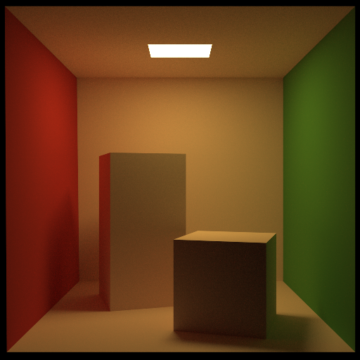
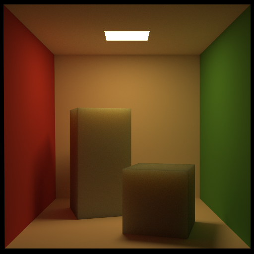
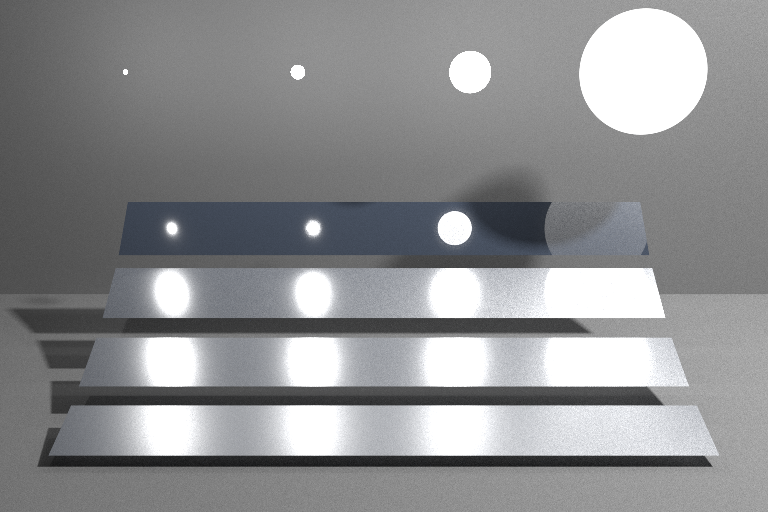
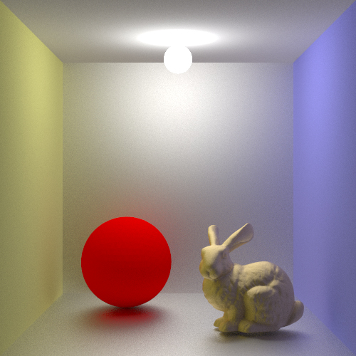

spica
===

[](./LICENSE)
[](https://travis-ci.org/tatsy/spica)
[](https://ci.appveyor.com/project/tatsy/spica)
[](https://coveralls.io/r/tatsy/spica?branch=master)

> **spica** is a cross-platform physically-based renderer.
> The project is maintained to be light-weight. All the dependencies
> can be installed as a Git's submodule system!

## Installation

#### Build

This project uses C++17. The build is tested under following environments.

* GNU C compiler (v7.3.0 or higher)
* Microsoft Visual C++ compiler (MSVC 2017)

#### Command

```shell
$ git clone --depth=10 https://github.com/tatsy/spica.git
$ git submodule update --init --recursive
$ mkdir build && cd build
$ cmake -D CMAKE_BUILD_TYPE=Release -D SPICA_BUILD_MAIN=ON [-D WITH_SSE=ON] ..
$ cmake --build .
$ make install
```

## Results

#### Cornell box



Simple path tracing (1000 spp)
The scene courtesy of Mitsuba renderer (W. Jakob 2010).

#### Cornell box (Subsurface Scattering)



Simple path tracing (5000 spp)
The scene is courtesy of Mitsuba renderer (W. Jakob 2010).

#### Multiple importance sampling



Direct lighting only (1000 spp)
The scene is courtesy of Mitsuba renderer (W. Jakob 2010).

#### Cornell box (with glossy surfaces)



Bidirectional path tracing (256 spp)


## Acknowledgment

This renderer is largely inspired by PBRT v3 by M. Pharr, G. Humphreys and W. Jakob. The author would like to sincerely appreciate the authors for allowing the open access to their source codes.

The author sincerely would also like to thank for HDR images provided by sIBL Archive [http://www.hdrlabs.com/sibl/archive.html](http://www.hdrlabs.com/sibl/archive.html). These images are licensed under the Creative Commons Attribution-Noncommercial-Share Alike 3.0 License.

## License

The MIT License (MIT). Copyright (c) 2015-2018 Tatsuya Yatagawa (tatsy).
