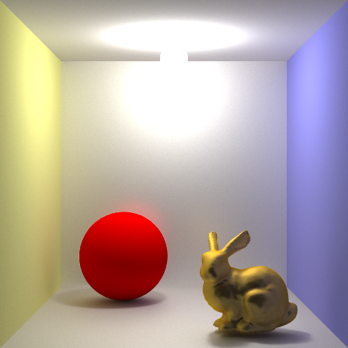

spica
===

[](./LICENSE)
[](https://travis-ci.org/tatsy/spica)
[](https://coveralls.io/r/tatsy/spica?branch=master)

> **spica** is a cross-platform physically-based renderer.

## Installation

#### Build

This project uses C++11/14. The build is tested under following environments.

* GNU C compiler (v4.9.0 or higher)
* LLVM Clang (v3.7.0 or higher)
* Xcode 8.0 beta
* Microsoft Visual C++ compiler (MSVC 2015)

#### Requirements

This project uses ```Boost C++ Libraries``` for XML parsing. You can download required package
by ```git submodule update``` or you can specify your own boost library which is already
installed in your computer.

* Boost 1.60.0 (property_tree)

The optional GUI for the renderer is programmed with ```Qt 5.5```. Therefore,
you should download and install Qt 5.5 or higher to use the GUI.

#### Command

```shell
$ git clone https://github.com/tatsy.spica.git
$ cmake [-DSPICA_BUILD_VIEWER=ON/OFF] ..
$ cmake --build .
```

## Results

#### Cornell Box


Simple path tracing, 1000 spp.
The scene courtesy of Mitsuba renderer (W. Jakob 2010).

#### Cornell Box (Subsurface Scattering)


Simple path tracing, 5000 spp.
The scene is courtesy of Mitsuba renderer (W. Jakob 2010).

#### Multiple Importance Sampling


Direct lighting only, 1000 spp.
The scene is courtesy of Mitsuba renderer (W. Jakob 2010).

#### Cornell Box (Glossy Surfaces)



Bidirectional path tracing, 1000 spp.


## Acknowledgment

This renderer is largely inspired by PBRT v3 by M. Pharr, G. Humphreys and W. Jakob. The author would like to sincerely appreciate the authors for allowing the open access to their source codes.

The author sincerely would also like to thank for HDR images provided by sIBL Archive [http://www.hdrlabs.com/sibl/archive.html](http://www.hdrlabs.com/sibl/archive.html). These images are licensed under the Creative Commons Attribution-Noncommercial-Share Alike 3.0 License.

## License

The MIT License (MIT). Copyright (c) 2015-2016 Tatsuya Yatagawa (tatsy).
