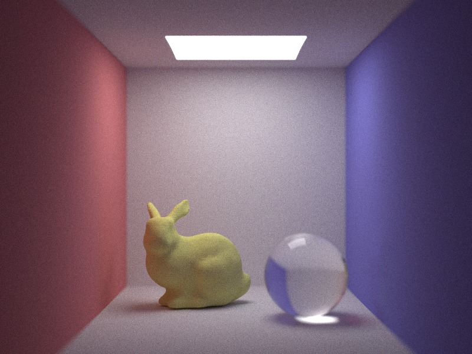
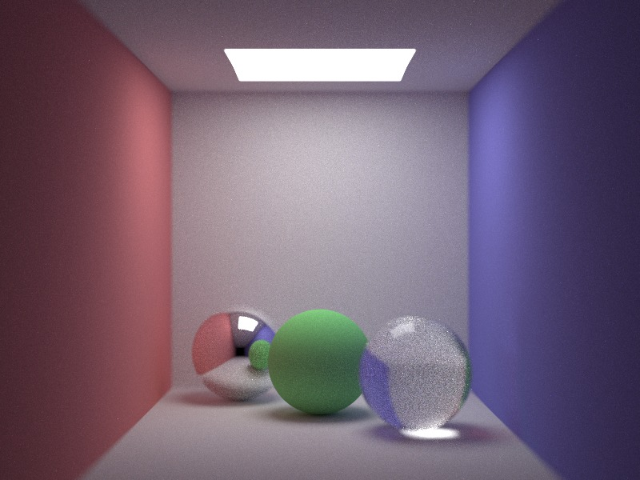
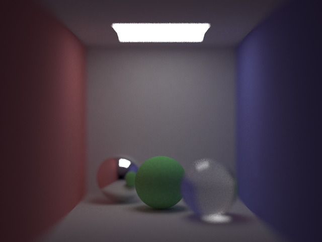
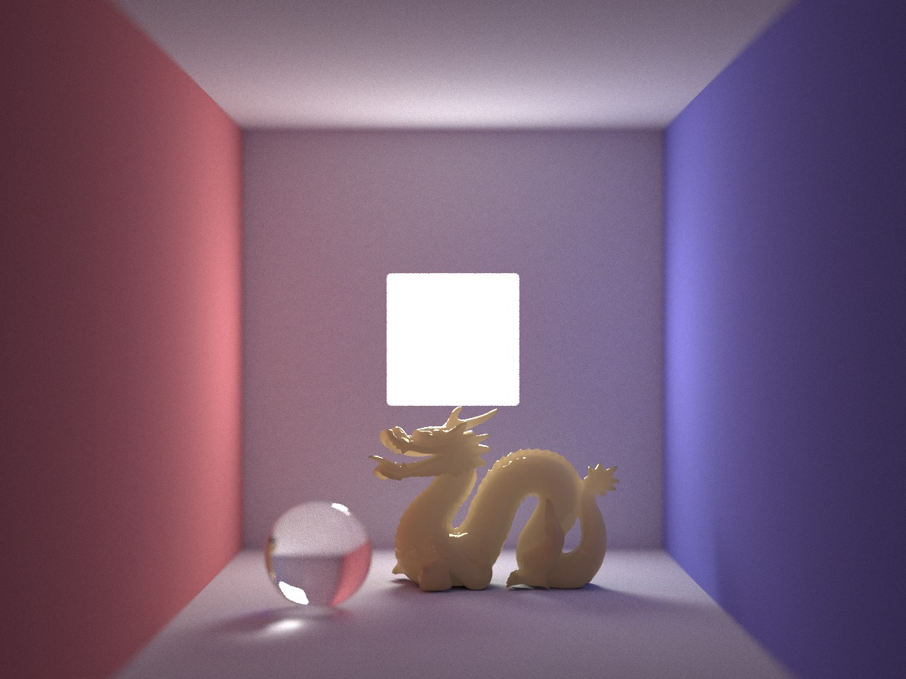

spica
===

> **spica** is a cross-platform physically-based renderer that is written in C++.

## Renderer

* Monte-Carlo path tracing
* Bidirectional path tracing
* Metropolis light transport (Kelemen style)
* Photon mapping
* Stochastic progressive photon mapping

## Materials

* Lambertian
* Specular
* Complete refract
* Subsurface scattering (dipole diffusion)

## Sampler

* Mersenne twister
* Quasi Monte Carlo (permuted Halton sequence)

#### Future support

* Precomputed radiance transfer

## Data structure for rendering acceleration

* K-D tree
* QBVH (with SIMD)

## Results

#### Path tracing

#### Bidirectional path tracing

#### Metropolis light transport

#### Photon mapping

#### Progressive photon mapping

#### Subsurface scattering (Stochastic progressive photon mapping)

## License

* MIT license 2015, Tatsuya Yatagawa (tatsy).
