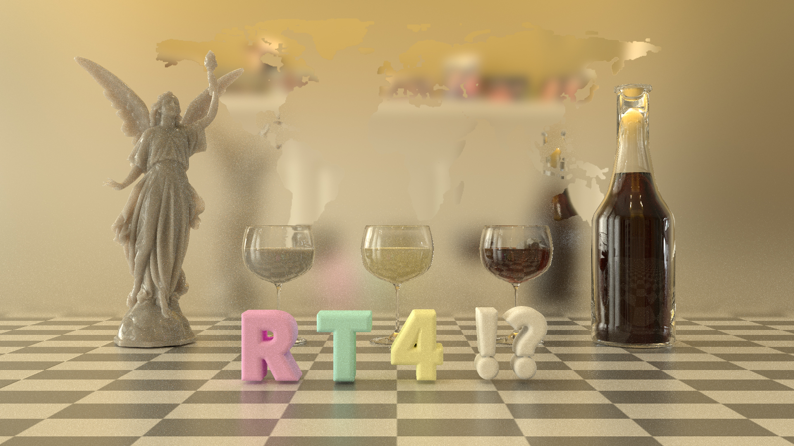
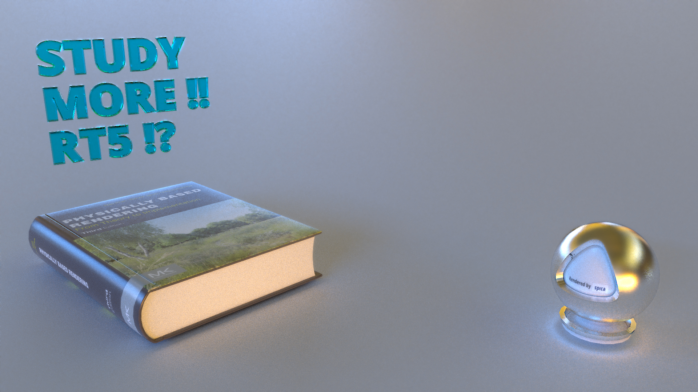

spica scenes
===

Test scenes of spica can be downloaded from following links. Also, these files can be downloaded with ``scenes/download.py``.

### Cornell box

Bidirectional path tracing (256 spp) - [Download](https://www.dropbox.com/s/red71zuqknwwvyn/cbox2.tar.gz?dl=1)

### RT4 scene

This is a scene for [Ray tracing camp](https://sites.google.com/site/raytracingcamp4/), which is a Japanese domestic event for ray tracing fans.

Stochastic progressive photon mapping (1000 spp) - [Download](https://www.dropbox.com/s/vanvnry96vbfm66/rt4scene.tar.gz?dl=1)

### RT5 scene

Gradient-domain path tracing (256 spp) - [Download](https://www.dropbox.com/s/7ph570vovgy3at8/rt5scene.tar.gz?dl=1)
